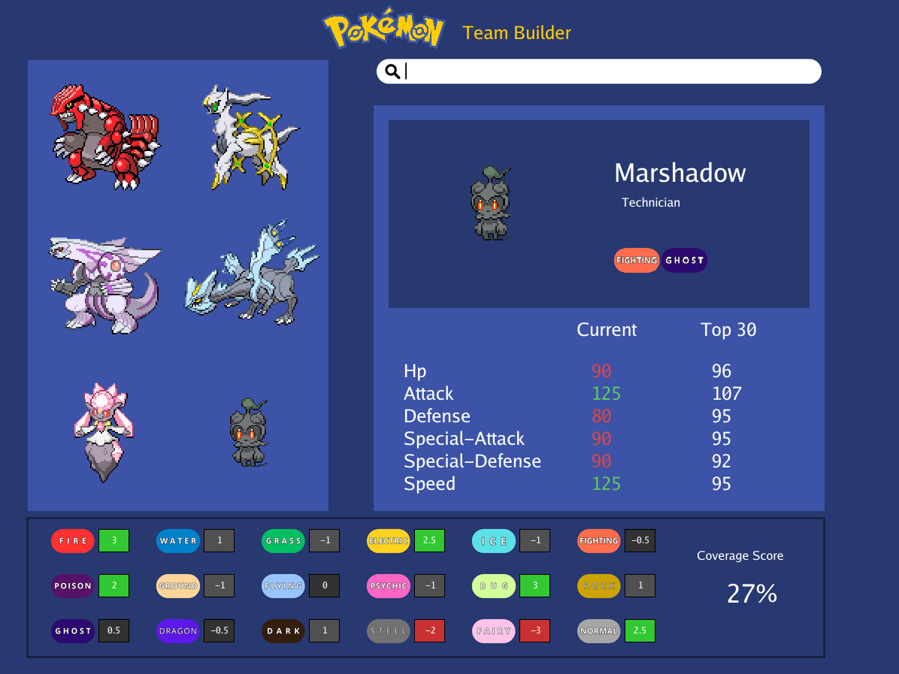
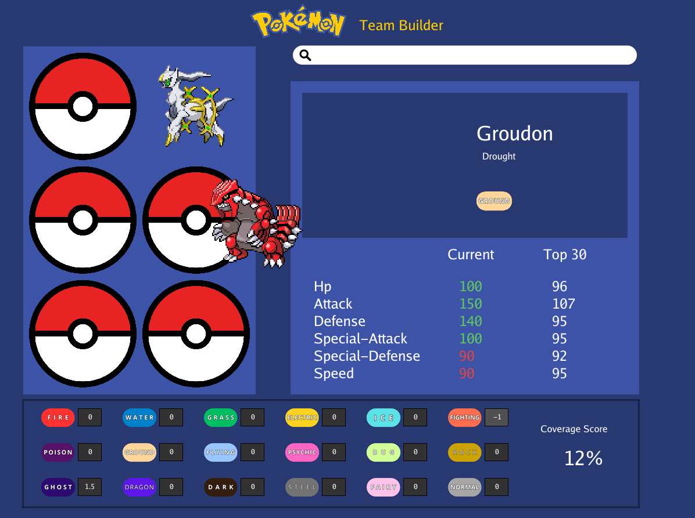
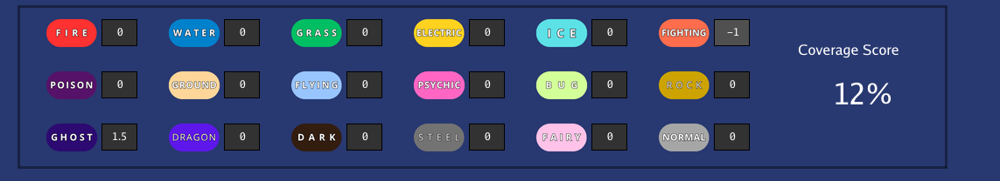
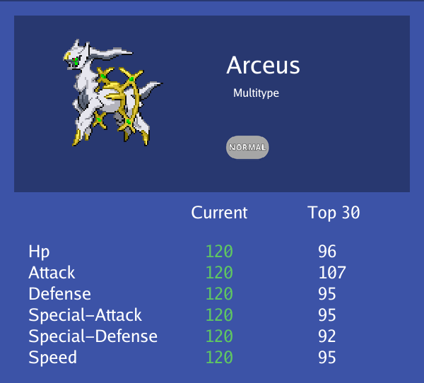

# Pokemon Team Builder

A powerful and intuitive Pokemon team building tool built with Go and Ebitengine. This application provides comprehensive team analysis with access to the latest Pokemon data and competitive statistics.

*A hackathon project for [Boot.dev](https://boot.dev/)*

## Features

- **Live Pokemon Data**: Access to the most recent Pokemon data via PokeAPI
- **VGC Statistics Integration**: Stat comparison with average stats from the top 30 Pokemon in the latest VGC regulation, courtesy of Pikalytics
- **Drag & Drop Interface**: Intuitive sprite-based team building with drag-and-drop functionality
- **Dynamic Coverage Analysis**: Real-time analysis of your team's type coverage that adapts and scores even with incomplete teams
- **Search Functionality**: Quick Pokemon lookup - just type the name and press Enter
- **Interactive Team Slots**: Visual pokeball slots for your team members

## Screenshots

<!-- Add your screenshots here -->

### Main Interface


### Team Building


### Coverage Analysis


### Stat Comparison


## Prerequisites

Before running this application, ensure you have the following installed:

- **Go 1.22 or later**: Download from [https://golang.org/dl/](https://golang.org/dl/)
- **Ebitengine**: Install following the instructions at [https://ebitengine.org/en/documents/install.html](https://ebitengine.org/en/documents/install.html)

## Installation

1. Clone the repository:
   ```bash
   git clone https://github.com/BrenoCRSilva/pokemon-team-builder.git
   cd pokemon-team-builder
   ```

2. Install dependencies:
   ```bash
   go mod tidy
   ```

3. Run the application:
   ```bash
   go run .
   ```

## How to Use

1. **Search Pokemon**: Type the name of any Pokemon in the search field and press Enter
2. **Add to Team**: Drag the Pokemon sprite from the search results to any of the six pokeball slots
3. **Analyze Coverage**: View your team's dynamic type coverage analysis that adapts in real-time, providing scores even for incomplete teams
4. **Compare Stats**: See how your Pokemon's stats compare to the VGC meta average
5. **Build Your Team**: Continue adding Pokemon until you have your perfect team composition

## Data Sources

- **Pokemon Data**: [PokeAPI](https://pokeapi.co/) - Comprehensive Pokemon data API
- **VGC Statistics**: [Pikalytics](https://pikalytics.com/) - Competitive Pokemon usage and statistics

## Technical Details

This application is built using:
- **Go**: Primary programming language
- **Ebitengine**: 2D game engine for the user interface and graphics
- **PokeAPI**: RESTful API for Pokemon data
- **Pikalytics Data**: VGC usage statistics and meta analysis

## System Requirements

- Operating System: Windows, macOS, Linux, or FreeBSD
- Go 1.22+
- OpenGL 2.1 or later (for Ebitengine)
- Internet connection (for API data)

## Contributing

Contributions are welcome! Please feel free to submit a Pull Request. For major changes, please open an issue first to discuss what you would like to change.

## License

This project is licensed under the MIT License - see the [LICENSE](LICENSE) file for details.

## Acknowledgments

- [Boot.dev](https://boot.dev/) for hosting the hackathon that inspired this project
- [Wolfey VGC](https://www.youtube.com/@WolfeyVGC) for the inspiration and invaluable Pokemon knowledge shared with the community
- [PokeAPI](https://pokeapi.co/) for providing comprehensive Pokemon data
- [Pikalytics](https://pikalytics.com/) for VGC usage statistics
- [Ebitengine](https://ebitengine.org/) for the excellent 2D game engine
- The Pokemon Company for creating the amazing world of Pokemon

## Support

If you encounter any issues or have questions, please open an issue on the GitHub repository.

---

*Built with deep respect and admiration for the Pokemon competitive community*
